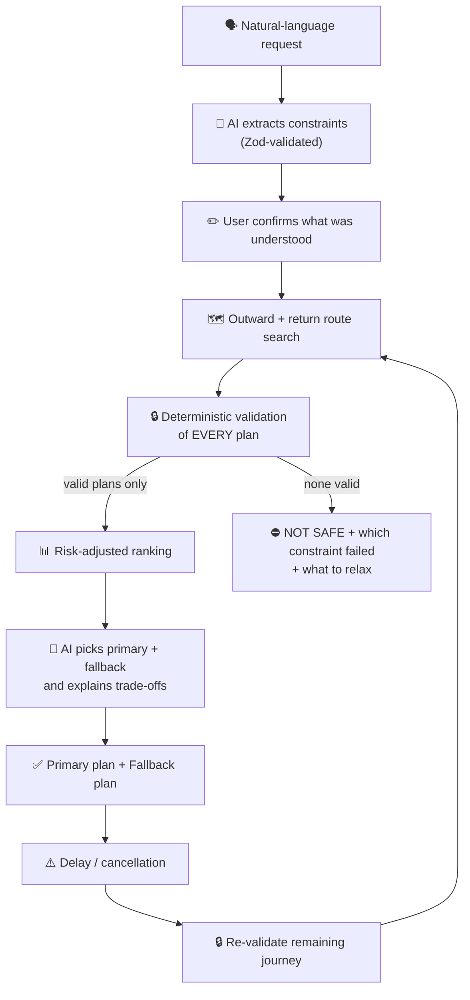

🧭 BackBy
The AI Return Assurance Agent for students who are new to a city
> **Navigation apps optimise the next route. BackBy determines whether you can safely and affordably complete the *entire* outing, including disruptions.**

---
The problem
Moving to a new city is hard. You don't know the last train time, what an auto should cost, or whether the bus you took there even runs back. Google Maps will happily send you to a mall at 9 PM, but it won't tell you that:
your money won't cover the way back,
the last metro leaves before your hostel curfew allows you to wait,
one cancelled bus leaves you stranded with an empty wallet.
Students end up paying triple for a late-night auto, or worse, locked out of the hostel.
The idea
You describe your outing in plain language:
> *"I'm at my Guindy hostel and want to go to Marina Beach at 4 PM for about 2 hours. Budget ₹600, keep ₹200 as emergency reserve, curfew 9:30 PM. I prefer metro and bus."*
BackBy plans the complete round trip, not just the next leg, and only recommends plans that:
✅ stay within your budget,
✅ protect your emergency-return reserve,
✅ get you back before curfew, with a safety buffer,
✅ survive realistic delays,
then gives you a primary plan, a fallback plan, and a plain-English explanation of why. If a leg gets delayed or cancelled, it re-plans automatically from wherever you are.
---
Design principle: AI proposes, code disposes
The most important decision in BackBy is what we don't let the AI do.
✅ AI is used for	🔒 Deterministic TypeScript code handles
Understanding natural-language requests	Fare arithmetic (integer paise, no floats)
Extracting structured constraints	Budget validation
Choosing between already-valid plans	Curfew validation with per-mode delay allowances
Explaining trade-offs	Reserve protection
Advising on borderline re-planning	Duration calculations
	Route eligibility & service windows
	Final safety checks
The AI can only recommend plans that the constraint engine has already approved. An unvalidated route is never shown to the user.
---
How it works

The constraint engine
Every candidate plan passes through `validatePlan()`, which returns each check with its actual value vs. limit, so the reasoning is fully transparent:
Check	What it guarantees
Continuity	Legs connect in place and in time order
Eligibility	Modes match preferences; every leg departs within its service window (last bus/metro/train)
Budget	Worst-case outward + return cost fits within budget minus reserve
Reserve	The emergency reserve stays intact and covers the cheapest fallback return from the destination
Curfew	Worst-case arrival (with per-mode delay allowances) is before curfew minus a buffer
Fare uncertainty	Unknown fares are rejected, or flagged and priced at a conservative estimate if the user allows
A separate deterministic risk score (0-100) ranks valid plans using curfew slack, budget slack, last-service margin, number of transfers and fare uncertainty.
---
Failure recovery
BackBy is designed to fail visibly and safely rather than silently.
Failure	Behaviour
Routing service unavailable	Clear "routing unavailable" state, no crash, no guessed routes
Missing / uncertain fare	Plan rejected, or flagged and priced conservatively if the user opts in
AI response fails schema validation	Retry once, then fall back to a rule-based parser and ranker with a visible banner
AI suggests a plan that isn't in the validated set	Rejected outright
Delayed or cancelled leg	Automatic re-plan from current location, time and remaining budget
No plan satisfies every constraint	Shows which constraint failed and what to relax; the least-bad option is clearly labelled NOT SAFE
Network lost after a plan is created	Last verified plan stays available offline with its timestamp
---
Demo scenarios (Chennai)
The seeded demo dataset covers 13 locations across bus, metro, suburban train and auto. These scenarios are encoded as automated tests:
#	Scenario	What it proves
S1	Guindy hostel → Marina Beach, ₹600 budget, ₹200 reserve, 9:30 PM curfew	The happy path: valid plan with thin but positive curfew slack
S2	Bus-only route with an unknown fare	Uncertain fares are gated, not guessed
S3	Leaving for Phoenix Marketcity at 8:30 PM with an 11 PM curfew	No safe plan exists, and BackBy says so instead of bluffing
S4	₹150 budget with ₹100 reserve	Impossible budget is caught, showing how much more is needed
S5	Auto ride back after 11 PM	Night surcharge applied before budget checks
S6	Return metro leg cancelled	Automatic re-planning from the user's current position
> ⚠️ **Demo data.** Fares, durations and service windows are approximations for building and testing. Verify against CMRL, Southern Railway and MTC before real-world use.
---
Tech stack
TypeScript end to end (strict mode)
React + Vite frontend
Express backend
Zod for schema validation of every AI response
Vitest for the test suite
Gemini API (free tier) for language understanding, behind an injectable client so it can be mocked and replaced
PWA service worker for offline access to the last verified plan
---
Project structure
```
backby/
├── shared/
│   └── types.ts            # Leg, Plan, Constraints, Fare types
├── server/
│   ├── engine/             # 🔒 Deterministic core
│   │   ├── money.ts        #    integer-paise arithmetic
│   │   ├── time.ts         #    minute-based time handling
│   │   ├── validate.ts     #    the constraint engine
│   │   └── risk.ts         #    0-100 risk scoring
│   ├── routing/            # Provider interface, mock provider, route search
│   └── ai/                 # 🤖 AI layer with guardrails (in progress)
├── data/
│   └── chennai-demo.json   # Seeded transit graph
└── tests/                  # Vitest suites
```
---
Project status
BackBy is under active development. The deterministic core is complete and tested; the AI layer and interface are being built on top of it.
[x] Stage 1: Constraint engine: continuity, eligibility, budget, reserve, curfew, unknown-fare handling, risk scoring
[x] Stage 2: Route search: mock Chennai provider, outward/return search, plan combination, NOT SAFE fallback, outage simulation
[ ] Stage 3: AI layer: natural-language parsing, plan selection, explanation, schema-validation fallback
[ ] Stage 4: User interface: request box, confirm-what-I-understood card, primary/fallback plans, validation transparency, disruption simulator
[ ] Stage 5: Offline + deployment: PWA, cached last verified plan, live demo
Current test suite: 45 automated tests passing, TypeScript typecheck clean.
---
▶️ Run it locally
```bash
git clone https://github.com/YOUR-USERNAME/YOUR-REPO.git
cd YOUR-REPO
npm install

npm test              # run the test suite
npm run typecheck     # type-check the whole project
```
To enable the AI layer, add a Gemini API key as `LLM_API_KEY` in your environment. Without it, BackBy automatically runs in rule-based mode.
---
Scope
BackBy deliberately does one thing well. It does not include social networking, tourist discovery, biometric detection, automatic emergency recording or payments.
---
